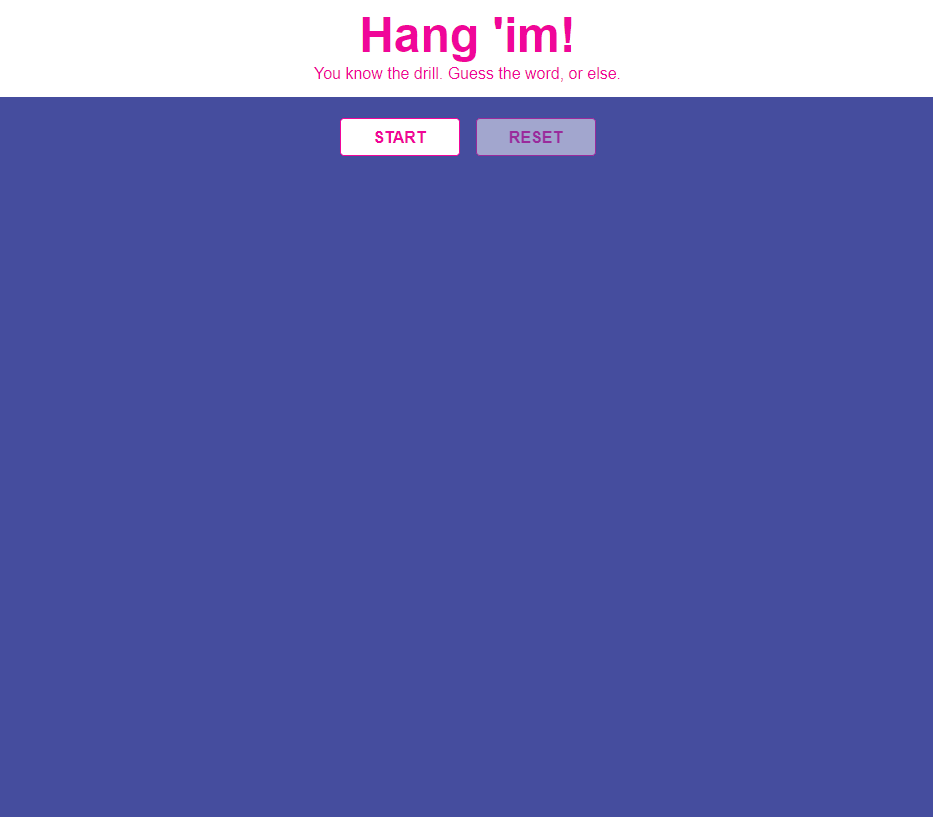

# Hangman

## 🦊 Pre-lecture

⏲️ _Estimated time required: 45 minutes._

- [React: Using the State Hook](https://reactjs.org/docs/hooks-state.html)
- [Video: React useState Hook](https://www.youtube.com/watch?v=uh4b0QtTlgM)

---

## 🦉 Lecture

- [Lecture 1 | Housekeeping](__lecture/lecture-1-housekeeping.md)
- [Lecture 2 | State](__lecture/lecture-2-state.md)
- [Lecture 3 | Classes](__lecture/lecture-3-classes.md)

Keep in mind that these slides are not interactive, like in the actual lecture. Whenever possible, we will provide links to working code examples in CodeSandbox.

---

Today you are going to build a hangman game!

You will **not** be writing this from scratch. Some of the code has been provided to you.



## Setup

### Install the dependencies

```
yarn install
```

### Spin up the dev environment

```
yarn start
```

---

## ⚡ Exercises

You have been provided with a static version of the game. All of the components are there. Most of the styling is done, but you need to wire everything together with state.

### [Exercise 1](__workshop/exercise-1.md) - Create initial game state

### [Exercise 2](__workshop/exercise-2.md) - The Start Button

### [Exercise 3](__workshop/exercise-3.md) - Get a random word

### [Exercise 4](__workshop/exercise-4.md) - Render the Word

### [Exercise 5](__workshop/exercise-5.md) - Dead Letters

### [Exercise 6](__workshop/exercise-6.md) - The Keyboard

### [Exercise 7](__workshop/exercise-7.md) - `usedLetters`

---

<center>🟡 - Minimally complete workshop (75%) - 🟡</center>

---

### [Exercise 8](__workshop/exercise-8.md) - Handle the User Guess

### [Exercise 9](__workshop/exercise-9.md) - Resetting the Game

### [Exercise 10](__workshop/exercise-10.md) - Ending the game

---

<center>🟢 - Complete workshop (100%) - 🟢</center>

---

### [Exercise 11](__workshop/exercise-11.md) - Show Game End Message


### [Exercise 12](__lworkshop/exercise-12.md) - Hanging the Man!
