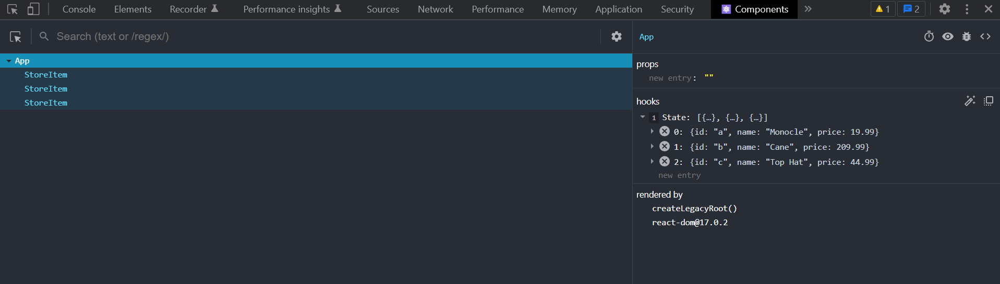
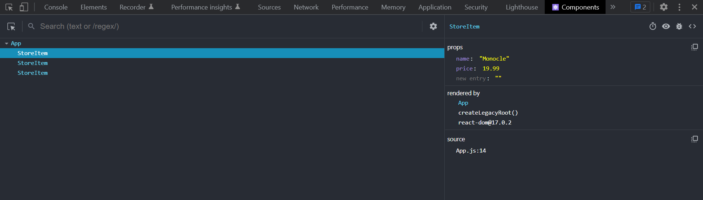

# React State

---

## Application state

State is _dynamic data_. Things that change.

---

## Example

```jsx live=true
const Counter = () => {
  const [count, setCount] = React.useState(0);

  return (
    <>
      <p>Count: {count}</p>
      <button onClick={() => setCount(count + 1)}>Increment</button>
    </>
  );
};

render(<Counter />);
```

---

# Destructuring

These snippets are identical:

```jsx
// Using destructuring:
const [value, setValue] = useState(null);
```

```jsx
// Without destructuring:
const valueState = useState(null);
const value = valueState[0];
const setValue = valueState[1];
```

---

# `useState`

"useState" is a **React hook**.

Hooks are way of "hooking into" React's abilities, like managing state.

---

# 🙅‍♀️ Mutating state

This snippet won't throw an error, but it also won't work:

```jsx
let [value, setValue] = useState(null);

value = 10;
```

---

# Re-rendering

When you call the state setter, it _triggers a re-render_.

This is why the values on the screen change.

---

# Forms in React

---

`value` and `onChange`

```jsx live=true
const Name = () => {
  const [name, setName] = React.useState("");

  return (
    <div style={{ fontSize: 32 }}>
      <input
        type="text"
        value={name}
        onChange={(ev) => {
          setName(ev.target.value);
        }}
        style={{ fontSize: 32 }}
      />
      <p>Your name is {name}</p>
    </div>
  );
};

render(<Name />);
```

---

# Exercises

What is logged in the following scenarios?

---

The button is clicked **3 times**:

```jsx live=true inline=true
const SomeComponent = () => {
  const [count, setCount] = React.useState(10);

  console.log(count);

  return <button onClick={() => setCount(count + 1)}>One, Two, Three!</button>;
}
```

---

The user types "!" in the input

```jsx live=true inline=true
const SomeComponent = () => {
  const [thing, setThing] = React.useState("Hi");

  console.log(thing);

  return <input value={thing} onChange={(ev) => setThing(ev.target.value)} />;
}
```

---

The user types "123" in the input

```jsx live=true inline=true
const SomeComponent = () => {
  const [thing, setThing] = React.useState(0);

  console.log(thing);

  return (
    <input
      value={thing}
      onChange={(ev) => setThing(thing + Number(ev.target.value))}
    />
  );
}
```

---

The user clicks the checkbox

```jsx live=true inline=true
const SomeComponent = () => {
  const [agreed, setAgreed] = React.useState(false);

  console.log(agreed);

  return (
    <label>
      <input
        type="checkbox"
        checked={agreed}
        onChange={(ev) => setAgreed(!agreed)}
      />
      Yes I want to receive spam
    </label>
  );
}
```

---

# State and Props

---

What happens when you want to share state between components?

---

```jsx
const App = () => {
  return (
    <>
      <SearchInput />
      <SearchResults />
    </>
  );
};

const SearchInput = () => {
  const [searchTerm, setSearchTerm] = useState("");

  return (
    <input
      type="text"
      value={searchTerm}
      onChange={(ev) => {
        setSearchTerm(ev.target.value);
      }}
    />
  );
};

const SearchResults = () => {
  // ??
};
```

---

This is called "lifting state up".

---

# Exercises

Lift state up in the following examples

---

<Timer />

```jsx live=true
const Counter = () => {
  const [count, setCount] = React.useState(0);

  return (
    <>
      <button onClick={() => setCount(count + 1)}>Increment</button>
    </>
  );
};

const App = () => {
  return (
    <>
      The current count is: ???
      <Counter />
    </>
  );
};

render(<App />);
```

---

```jsx live=true
const FavouriteFood = () => {
  const [food, setFood] = React.useState("");

  return (
    <>
      <label>
        <input
          type="radio"
          name="food"
          value="pizza"
          checked={food === "pizza"}
          onChange={() => setFood("pizza")}
        />
        Pizza
      </label>
      <label>
        <input
          type="radio"
          name="food"
          value="broccoli"
          checked={food === "broccoli"}
          onChange={() => setFood("broccoli")}
        />
        Broccoli
      </label>
    </>
  );
};

const App = () => {
  return (
    <>
      <p>My favourite food is: ???</p>
      <FavouriteFood />
    </>
  );
};

render(<App />);
```

---

### Conditional rendering

---

```jsx live=true inline=true
() => {
  const [showAnswer, setShowAnswer] = React.useState(false);

  return (
    <>
      <h3>What do you call someone with no body and no nose?</h3>

      {showAnswer && <p>Nobody knows!</p>}

      <button onClick={() => setShowAnswer(true)}>Show punchline</button>
    </>
  );
};
```

---

# React Devtools

They are a helpful browser extension that lets you see how React works! It also lets you see all the information inside a component.

---

Take this component for example

```jsx
const initialState = [
    { id: "a", price: 19.99, name: "Monocle" },
    { id: "b", price: 209.99, name: "Cane" },
    { id: "c", price: 44.99, name: "Top Hat" },
];

const App = () => {

    const [storeItems, setStoreItems] = useState(initialState);

    return (
        <div>
            {storeItems.map((item) => {
                return <StoreItem name={item.name} price={item.price} />
            })}
        </div>
    )
};
```

---

When we look at it through the devtools we see this:



By selecting the `<App />` component, we can see it has no props, and a state hook containing an array!

---

When we select the `<StoreItem />` component, we can see it has no hooks, but instead is receiving two props: `name` and `price`



---

The [React Devtools](https://chrome.google.com/webstore/detail/react-developer-tools/fmkadmapgofadopljbjfkapdkoienihi?hl=en) are a really good tool to make use of when playing with React.

PS: You're going to need them for today's workshop 😉.